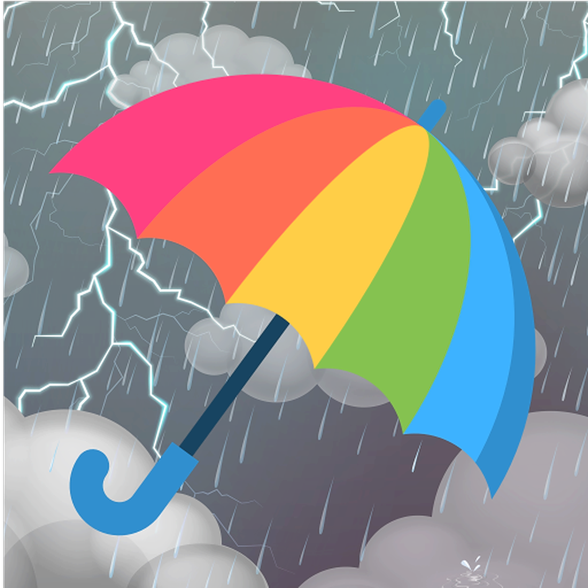

<h1 align="center">
   
  
   
  Vai Chover Hoje?
   
</h1>

<h4 align="center">Um simples App de monitorar o clima feito em <a href="https://flutter.dev/" target="_blank">Flutter</a>.</h4>

  
  
  
  

  <a href="#key-features">Funcionalidades</a> •
  <a href="#how-to-use">Como Usar</a> •
  <a href="#download">Download</a> •
  <a href="#credits">Créditos</a> •
  <a href="#related">Related</a> •
  <a href="#related">Licença</a> •
  <a href="#contato">Contato</a>

## Funcionalidades

* Consumo API [OpenWeather](https://openweathermap.org/);
* Consumo API [UnSplash](https://unsplash.com/);
* Dark/Light mode;
* Android e IOS.

## Como Usar

Você deve instalar o aplicativo em seu smartphone ou emulador através das lojas [Google Play](https://play.google.com/store?hl=pt_BR) ou [Apple Store](https://www.apple.com/br/ios/app-store/), após a instalação em seu primeiro uso será solicitado acesso aos recursos de localização através do GPS do aparelho. Uma vez concedido acesso o aplicativo verifica as condições climáticas nas proximidades!

## Download

    
    

## Emailware

Markdownify is an [emailware](https://en.wiktionary.org/wiki/emailware). Meaning, if you liked using this app or it has helped you in any way, I'd like you send me an email at <bullredeyes@gmail.com> about anything you'd want to say about this software. I'd really appreciate it!

## Credits

This software uses the following open source packages:

- [Electron](http://electron.atom.io/)
- [Node.js](https://nodejs.org/)
- [Marked - a markdown parser](https://github.com/chjj/marked)
- [showdown](http://showdownjs.github.io/showdown/)
- [CodeMirror](http://codemirror.net/)
- Emojis are taken from [here](https://github.com/arvida/emoji-cheat-sheet.com)
- UmbrellaIcon - Icons made by <a href="https://www.flaticon.com/authors/freepik" title="Freepik">Freepik</a> from <a href="https://www.flaticon.com/" title="Flaticon"> www.flaticon.com</a>

## Related

[markdownify-web](https://github.com/amitmerchant1990/markdownify-web) - Web version of Markdownify

## Support

    
    

## You may also like...

- [Pomolectron](https://github.com/amitmerchant1990/pomolectron) - A pomodoro app
- [Correo](https://github.com/amitmerchant1990/correo) - A menubar/taskbar Gmail App for Windows and macOS

## Licença

[MIT](https://github.com/arnoldosilva/vai_chover_hoje/blob/master/LICENSE)

---

## Contato

